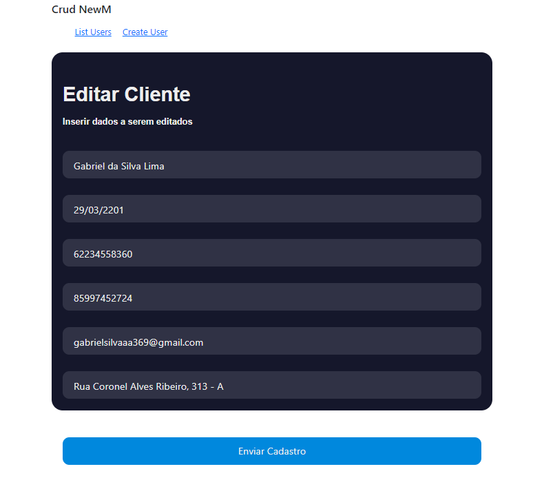

# CRUD COMPLETO

### Como inicar o projeto: 

- Entre no diretório do projeto: cd newm-selecao
- Instale todas as dependências

npm:

```sh
npm install
```

Rode a aplicação em seu servidor local: 

```sh
npm start
```





## Tecnologias e Dependências

| Name | Link |
| ------ | ------ |
| React | [https://pt-br.reactjs.org/] |
| axios | [https://github.com/axios/axios] |
| React Bootstrap | [https://react-bootstrap.github.io] |
| PHP | [https://www.php.net] |
| Xampp| [https://www.apachefriends.org/pt_br/index.html] |
